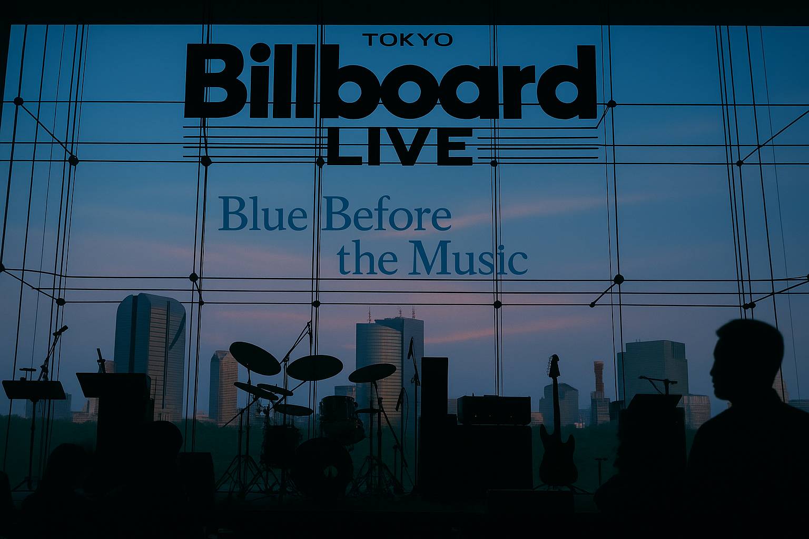
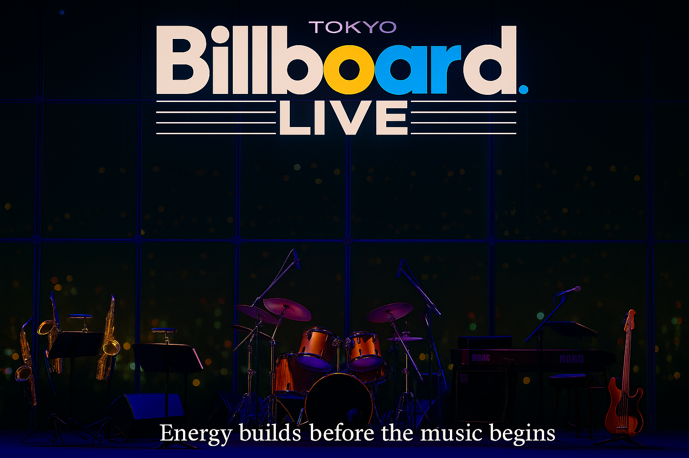
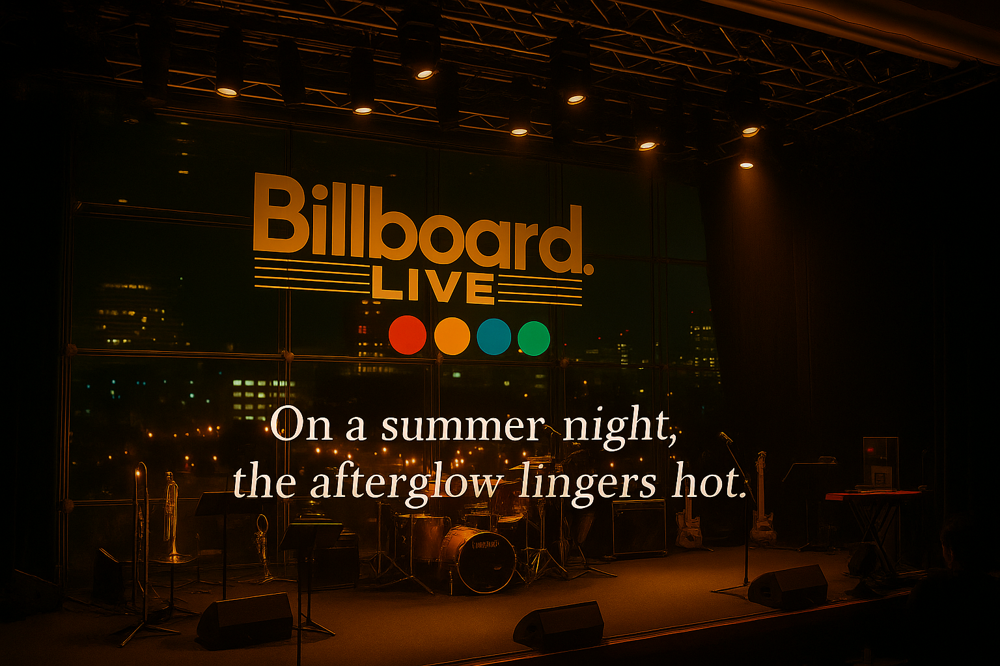

  This is an independent fan-made archive, not affiliated with Billboard Live Tokyo or related companies. 
  Empowered by <a href="https://openai.com/" target="_blank" rel="noopener" style="color:#666;text-decoration:underline;">ChatGPT</a>.

# Aug-19-2007 — Billboard Live Tokyo [360RA/UHD]

**EN:** A summer night in Roppongi, two hours before showtime—the skyline leads, conversations begin, and the city cools the day’s heat.  
**JP:** 六本木の夏の夜。開演二時間前、外の青さが主役で、会話と涼しさがゆっくり満ちていく。

  <a href="https://music.amazon.co.jp/user-playlists/cde5675021a04698ba0e51c0a7b7bc13jajp?ref=dm_sh_5646-30f6-5901-975e-21550&tag=shoichi-22"
     target="_blank" rel="sponsored nofollow noopener"
     style="display:inline-flex;align-items:center;gap:.55rem;
            background:#232F3E;color:#fff;text-decoration:none;
            padding:10px 14px;border-radius:8px;font-weight:700;
            font-family:system-ui,-apple-system,'Segoe UI',Roboto,'Helvetica Neue',Arial,sans-serif;
            box-shadow:0 6px 16px rgba(35,47,62,.18);
            transition:transform .08s ease,filter .2s ease;">
    
    Listen on Amazon Music
  </a>

---

## Visuals

### Before the Passion Unfolds
*Instruments waiting under warm downlights, holding a quiet charge before hearts ascend.*  

### Echoes and Afterimages — The Summer Night Heat Lingers
*After the applause, resonance and glow remain; the summer night keeps its warmth a little longer.*  

---

## Notes
- **Format legend:** [360RA] = 360 Reality Audio / [UHD] = Ultra HD Stereo  

## Credits
Photography: Shoichi Sato ・ Curation & Notes: Shoichi Sato / Hacchi ・ Venue: Billboard Live Tokyo ・ Year: 2007 (reconstructed in 2025)

  As an Amazon Associate I earn from qualifying purchases.

  当サイトはAmazonアソシエイト・プログラムの参加者です。適格販売により収入を得る場合があります。

