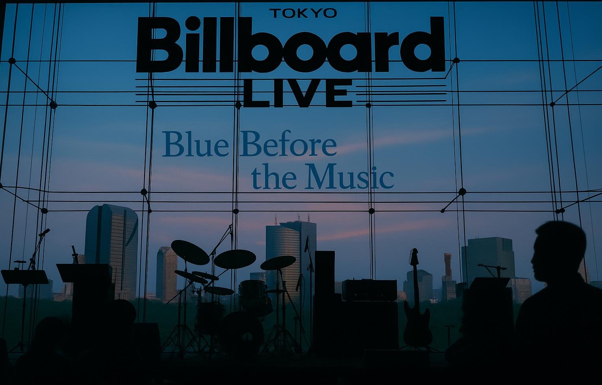

  This is an independent fan-made archive, not affiliated with Billboard Live Tokyo or related companies. 
  本ページはファンによる個人アーカイブであり、Billboard Live Tokyoの企画を応援しています。 
  Empowered by <b>ChatGPT</b>.

---

# Aug-19-2007 — Billboard Live Tokyo [360RA/UHD]

<!-- Block 1 -->

  <!-- Link Button -->
  

    <a href="AMAZON_LINK_1" target="_blank" rel="sponsored nofollow noopener"
       style="display:inline-flex;align-items:center;gap:.55rem;
              background:#232F3E;color:#fff;text-decoration:none;
              padding:10px 14px;border-radius:8px;font-weight:700;
              font-family:system-ui,-apple-system,'Segoe UI',Roboto,'Helvetica Neue',Arial,sans-serif;
              box-shadow:0 6px 16px rgba(35,47,62,.18);
              transition:transform .08s ease,filter .2s ease;">
      
      Listen on Amazon Music
    </a>
  

  <!-- Photo -->
  

  <!-- Caption -->
  

    

      <strong>In late-summer Roppongi</strong>, the sky holds a flawless blue, as if burnished by the season itself.
      Beyond, the silhouettes of distant towers stand in quiet command, while the evening breeze and low, easy voices
      spill gently into the gathering dusk.
    

    

      六本木の晩夏、空に青さが澄みわたっている。日暮れとともに、涼風と会話がゆっくり満ちていく。
    

  

<!-- Block 2 -->

  

    <a href="AMAZON_LINK_2" target="_blank" rel="sponsored nofollow noopener"
       style="display:inline-flex;align-items:center;gap:.55rem;
              background:#232F3E;color:#fff;text-decoration:none;
              padding:10px 14px;border-radius:8px;font-weight:700;
              font-family:system-ui,-apple-system,'Segoe UI',Roboto,'Helvetica Neue',Arial,sans-serif;
              box-shadow:0 6px 16px rgba(35,47,62,.18);
              transition:transform .08s ease,filter .2s ease;">
      
      Listen on Amazon Music
    </a>
  

  

  

    

      Instruments waiting under warm downlights, holding a quiet charge before hearts ascend.
    

    

      温かなダウンライトの下で待つ楽器たち。心が高ぶる瞬間を静かに待ち受ける。
    

  

<!-- Block 3 -->

  <!-- Link Button -->
  

    <a href="AMAZON_LINK_3" target="_blank" rel="sponsored nofollow noopener"
       style="display:inline-flex;align-items:center;gap:.55rem;
              background:#232F3E;color:#fff;text-decoration:none;
              padding:10px 14px;border-radius:8px;font-weight:700;
              font-family:system-ui,-apple-system,'Segoe UI',Roboto,'Helvetica Neue',Arial,sans-serif;
              box-shadow:0 6px 16px rgba(35,47,62,.18);
              transition:transform .08s ease,filter .2s ease;">
      
      Listen on Amazon Music
    </a>
  

  <!-- Photo -->
  

  <!-- Caption -->
  

    

      The resonance lingers, mingling with the warmth of a summer night, as if the music itself is reluctant to leave.
    

    

      響きは夏の夜の温もりと混じり合い、まるで音楽そのものが去りがたく留まっているかのよう。
    

  

---

<h2>Notes</h2>
<ul style="padding-left: 1.2em; margin-top: 0;">
  <li><strong>Format legend:</strong> [360RA] = 360 Reality Audio / [UHD] = Ultra HD Stereo</li>
</ul>

<h2>Credits</h2>
<ul style="padding-left: 1.2em; margin-top: 0;">
  <li><strong>Photography:</strong> Shoichi Sato</li>
  <li><strong>Curation &amp; Notes:</strong> Shoichi Sato ・ Hacchi</li>
  <li><strong>Venue:</strong> Billboard Live Tokyo</li>
  <li><strong>Year:</strong> 2007 (reconstructed in 2025)</li>
</ul>

---

  <!-- Amazon Music ボタン -->
  <a href="https://music.amazon.co.jp/user-playlists/cde5675021a04698ba0e51c0a7b7bc13jajp?ref=dm_sh_5646-30f6-5901-975e-21550&tag=shoichi-22"
     target="_blank" rel="sponsored nofollow noopener"
     style="display:inline-flex;align-items:center;gap:.55rem;
            background:#232F3E;color:#fff;text-decoration:none;
            padding:10px 14px;border-radius:8px;font-weight:700;
            font-family:system-ui,-apple-system,'Segoe UI',Roboto,'Helvetica Neue',Arial,sans-serif;
            box-shadow:0 6px 16px rgba(35,47,62,.18);
            transition:transform .08s ease,filter .2s ease;">
    
    Listen on Amazon Music
  </a>

  <!-- アフィリエイト表記 -->
  

    
As an Amazon Associate I earn from qualifying purchases.

    
当サイトはAmazonアソシエイト・プログラムの参加者です。適格販売により収入を得る場合があります。

  

